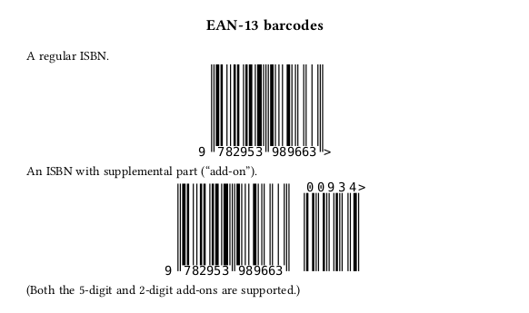

# barcodes.sile

[](LICENSE)
[](https://github.com/Omikhleia/barcodes.sile/actions?workflow=Luacheck)
[](https://luarocks.org/modules/Omikhleia/barcodes.sile)

This package set for the [SILE](https://github.com/sile-typesetter/sile) typesetting
system aims at providing barcode support.

It currently provides the `barcodes.ean13` package, which allows printing out an EAN-13 barcode, suitable for an ISBN (or ISSN, etc.)



The “human readable interpretation” in this example uses the “Hack” font.
Any other monospace font may be used, and a better result is obtained with an OCR-B font.
A good recommendation is [Matthew Skala's “OCR B” version](https://tsukurimashou.osdn.jp/ocr.php.en), which is considered public domain and is included in this package for mere convenience, see [details](packages/barcodes/ean13/fonts/README.md).

On a slightly related topic, you might also be interested in the [qrcode.sile](https://github.com/Omikhleia/qrcode.sile) package set.

## Installation

These packages require SILE v0.15.12.

Installation relies on the **luarocks** package manager.

To install the latest version, you may use the provided “rockspec”:

```
luarocks install barcodes.sile
```

(Refer to the SILE manual for more detailed 3rd-party package installation information.)

## Usage

Examples are provided in the [examples](./examples) folder.

The in-code package documentation may also be useful.
A readable version of the documentation is included in the User Manual for the [resilient.sile](https://github.com/Omikhleia/resilient.sile) collection of classes and packages.

## License

All SILE-related code and samples in this repository are released under the GNU General Public License v3.0, (c) 2022-2025 Omikhleia.

